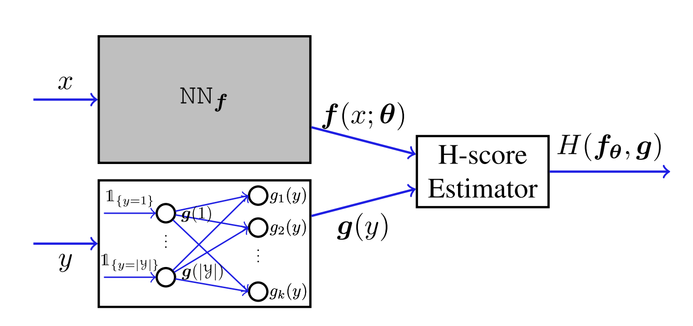
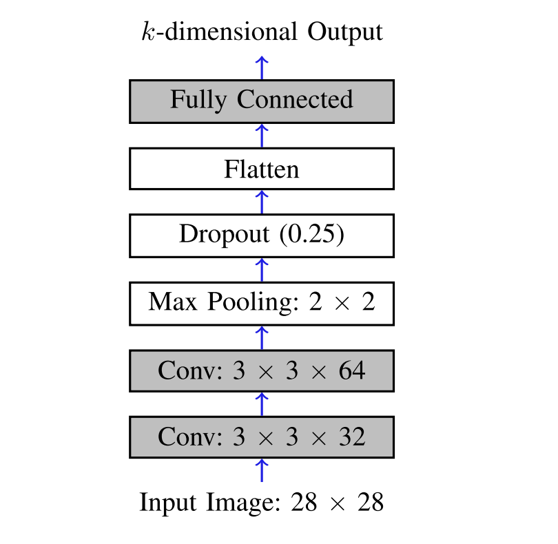
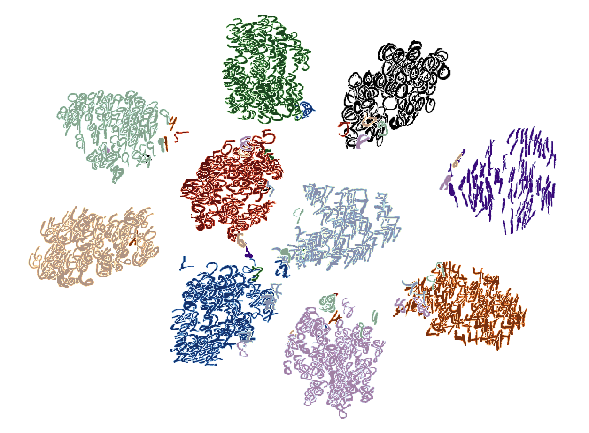
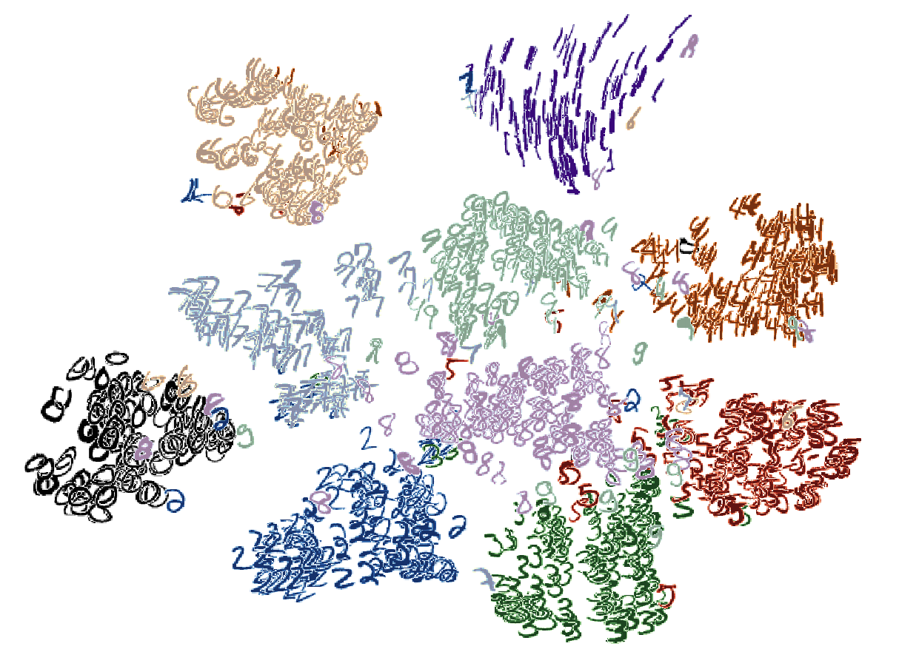

# A Keras Implementation for Maximal Correlation Regression (MCR) on MNIST 

This repository contains a simple [Keras](https://keras.io/) implementation of [Maximal Correlation Regression](https://ieeexplore.ieee.org/abstract/document/8979352) (MCR), on the [MNIST](http://yann.lecun.com/exdb/mnist/) dataset. 


## Maximal Correlation Regression
[Maximal Correlation Regression [1]](https://ieeexplore.ieee.org/abstract/document/8979352) (MCR) is a regression analysis approach based on Hirschfeld-Gebelein-Rényi (HGR) maximal correlation. The basic idea is to represent the dependency between data variable  and label  by their maximally correlated features  and .


## Implementation
The implementation is based on the maximizing of H-score of features f and g:


The network architecture is as follows [1, Figure 6]:



The feature extractor is a simple CNN [1, Figure 2], and by default the feature dimension is :



We can also compare the performance of MCR with the baseline method trained on Softmax classifier with Log loss (SL). When trained on 1,000 samples and set feature dimension , the extracted features for two methods can be visualized by T-SNE [2] as (left: MCR, right: SL)

<p float="left">
 &nbsp;

</p>


### Dependencies
* [Keras](https://keras.io/)


### Cite
If you use MCR in your work, please cite the original paper as:
```
@article{xu2020maximal,
  title={Maximal correlation regression},
  author={Xu, Xiangxiang and Huang, Shao-Lun},
  journal={IEEE Access},
  volume={8},
  pages={26591--26601},
  year={2020},
  publisher={IEEE}
}
```

### Related Algorithms
The method of optimizing H-score is also in for multi-modal feature extraction [3] and unsupervised feature extraction [4], with similar implementations.


### References 
[1] Xu, Xiangxiang, and Shao-Lun Huang. "Maximal correlation regression." IEEE Access 8 (2020): 26591-26601.

[2] Van der Maaten, Laurens, and Geoffrey Hinton. "Visualizing data using t-SNE." Journal of machine learning research 9.11 (2008).

[3] Wang, Lichen, Jiaxiang Wu, Shao-Lun Huang, Lizhong Zheng, Xiangxiang Xu, Lin Zhang, and Junzhou Huang. "An efficient approach to informative feature extraction from multimodal data." In Proceedings of the AAAI Conference on Artificial Intelligence, vol. 33, no. 01, pp. 5281-5288. 2019.

[4] Huang, Shao-Lun, Xiangxiang Xu, and Lizhong Zheng. "An information-theoretic approach to unsupervised feature selection for high-dimensional data." IEEE Journal on Selected Areas in Information Theory 1.1 (2020): 157-166.
